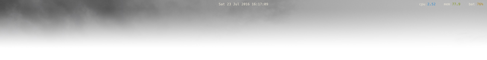

# zenbar



Übersicht system information bar for use with kwm window
manager. A fork of herrbischoff's
[nerdbar](https://github.com/herrbischoff/nerdbar.widget)

## Installation

Make sure you have [Übersicht](http://tracesof.net/uebersicht/) installed.

Then clone this repository.

```bash
git clone https://github.com/zhaorz/zenbar $HOME/Library/Application\ Support/Übersicht/widgets/zenbar
```
